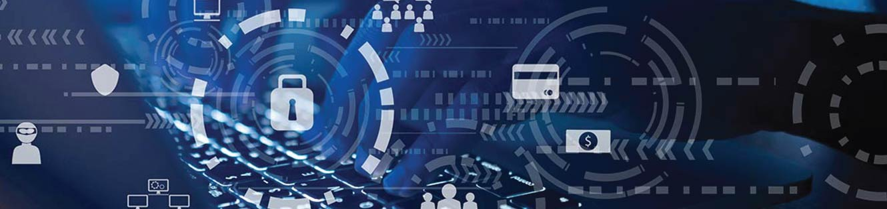
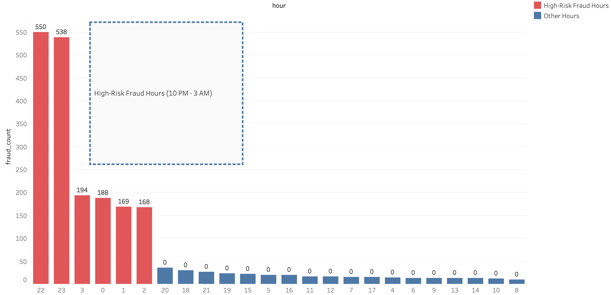
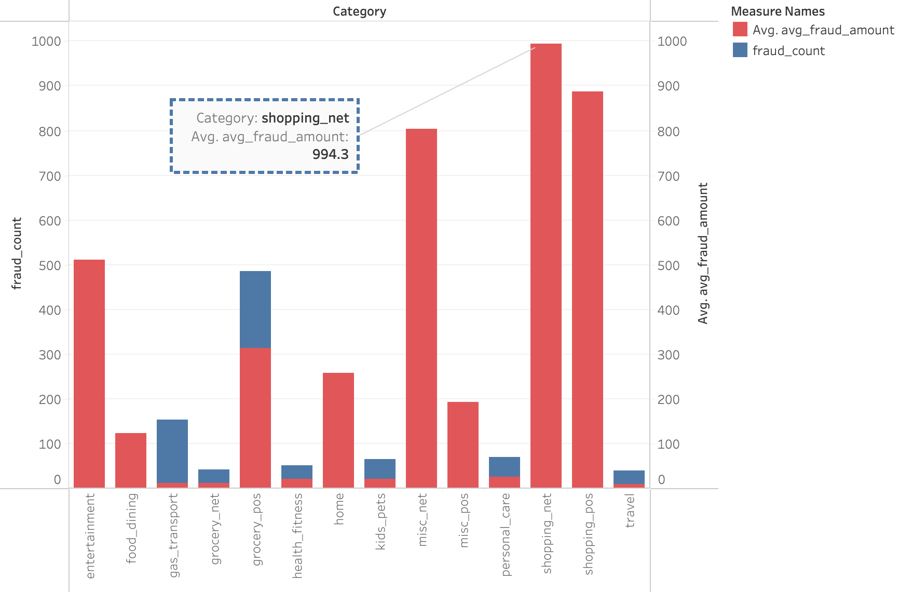
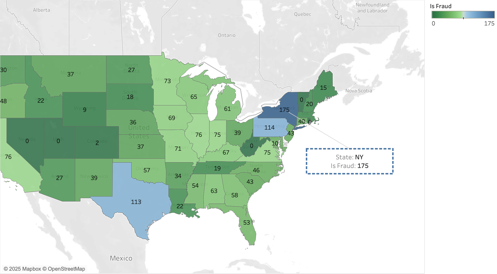

# Welcome to My Journey in Credit Card Fraud Detection

As a university student fascinated by the hidden insights within data, I embarked on this project driven by my passion for data analysis and a strong desire to make an impact. Ensuring the safety of credit card transactions is a pressing challenge, and I saw this as an opportunity to apply my analytical skills in a meaningful way.

With the ambition to help establish this company as the safest credit card provider, I focused on minimizing missed fraud cases. My approach was thoughtful yet cautious, erring on the side of flagging potentially fraudulent transactions, even at the risk of some false positives. This project isn’t just an academic exercise for me—it’s about real-world impact, protecting consumers, and learning invaluable lessons along the way.

# Source: Kaggle (https://www.kaggle.com/datasets/kartik2112/fraud-detection)

# How I Approached the Analysis

## 📊 Exploring the Data

I delved into a vast dataset of over 550,000 transactions, where fraud cases accounted for a mere 0.4%. The challenge was clear: find patterns that distinguish fraudulent transactions from legitimate ones.

To uncover hidden signals, I examined transaction attributes such as:
✔️ Transaction categories (e.g., online shopping, cash withdrawals)
✔️ Transaction amounts (e.g., high-value transactions)
✔️ Time of transaction (e.g., late-night fraud activity)
✔️ Geographic trends (e.g., states with higher fraud rates)

## 🛠️ Feature Engineering: Sharpening My Detection Tools

Realizing the need for better fraud indicators, I crafted new features to enhance fraud detection:
🚀 Transaction Time Patterns – Identified high-risk fraud hours.
🌎 Geographical Fraud Hotspots – Analyzed which states had higher fraud rates.
🛒 Risky Transaction Categories – Highlighted categories that saw the most fraud cases.

# 🔎 Key Findings: Uncovering the Fraud Playbook

## ⏰ Fraudsters Strike at Night

🔸 The highest fraud activity occurred between 10 PM and 3 AM—a time when users are less likely to notice unusual transactions.

**📊 Fraud Frequency by Hour:**  
  

## 🛒 Online Shopping & High-Value Transactions Are Prime Targets

🔸 E-commerce platforms were a major target for fraudsters, especially transactions over $500.

**📊 Fraud by Transaction Category:**  
  

**📊 Fraud by Transaction Amount:**  
  

## 🌍 The Fraud Capital: New York Leads in Fraud Rates

🔸 New York had the highest fraud rate, despite having fewer transactions than Texas, which had the highest transaction volume but a lower fraud rate.

**🗺️ Fraud Heatmap by State:**  
  

# 📈 Key Insights & Recommendations  

Based on my analysis, I propose the following strategies to **strengthen fraud detection**:  

## 🔴 Heighten Monitoring During Late-Night Hours  
🚨 **Increased scrutiny for transactions between 10 PM - 3 AM** can significantly reduce fraudulent activity.  

## 💰 Strengthen Checks on High-Ticket Transactions  
💳 **Tighter security protocols for transactions over $500**, particularly in online shopping, can prevent high-value fraud losses.  

## 📍 Focus Fraud Prevention Efforts on High-Risk Regions  
🗽 **New York has the highest fraud rate**—deploying **more robust fraud detection systems** in this region could mitigate risks.  

# Looking Ahead: The Future of Fraud Prevention

This journey in data-driven fraud detection has been both challenging and rewarding. By analyzing patterns of fraudulent behavior, I’ve learned how data science plays a crucial role in financial security.

Moving forward, I aim to:
🔹 Build machine learning models to automate fraud detection.
🔹 Expand feature engineering to detect emerging fraud tactics.
🔹 Develop interactive Tableau dashboards for real-time fraud tracking.

This project is just the beginning of my exploration into financial data analysis, and I’m excited to keep learning, refining my techniques, and contributing to real-world solutions in fraud prevention.
